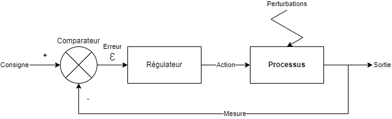

# IS-Fly-By-Wire - IaC

Une analyse d'un système d'information (SI) piloté par le "code" (IaC).

## Concepts

### Asservissement d'un système (processus industriel)

La structure générale d'un système asservi peut se représenter comme suit :

1. On indique une `Consigne` au système qui est la valeur que l'on souhaite obtenir en sortie (par ex. vitesse de moteur ou température du processus) ;
2. Le système compare cette `Consigne` avec la valeur actuellement mesurée et obtient ainsi une `Erreur` (Ɛ) ;
3. Le `Régulateur` utilise cette erreur pour calculer une `Action` corrective à appliquer au `Processus` ;
4. Le `Processus` réagit à la correction et fait évoluer sa valeur en `Sortie` ;
5. La `Mesure` se met à jour et le système boucle au point 2.

Enfin, si une `Perturbation` externe au `Processus` se produit, la `Sortie` s'écarte de la `Consigne` et la boucle de contre-réaction va donc *naturellement* corriger cet écart.

Cette méthode d'asservissement d'un processus est généreusement documentée et fait l'objet d'une modélisation très poussée. Dans le cas présent, il s'agit simplement d'une idée du principe d'asservissement d'un SI.

*Référence Wikipédia* : [https://fr.wikipedia.org/wiki/Asservissement (automatique)](https://fr.wikipedia.org/wiki/Asservissement_(automatique))

### Fly-by-Wire

Le terme français est « commandes de vol électriques » ne rend pas hommage aux fonctions portées par cette logique. Il s'agit en fait d'un certain nombre d'améliorations portées autour des calculateurs de vol embarqués dans les avions qui facilitent et sécurisent les actions réalisées par les pilotes pendant les différentes phase de vol. Les principes sont globalement les suivants :

* Un modèle (théorique) de l'avion est simulé par le calculateur de vol ;
* Le pilote agit sur le modèle uniquement et plus sur les actionneurs (gouvernes, *etc*.) de l'avion ;
* Le calculateur assure les commandes des actionneurs (généralement électriques ou hydrauliques) pour mettre l'avion dans la même situation que le modèle (boucle d'asservissement) ;
* Le calculateur vérifie que les ordres qu'il reçoit du pilote sont conformes aux caractéristiques techniques de l'avion (vitesse maximum, *etc.*).

*Référence Wikipédia* : [https://fr.wikipedia.org/wiki/Commandes de vol électriques](https://fr.wikipedia.org/wiki/Commandes_de_vol_%C3%A9lectriques)

### Infrastructure as Code (IaC)

Il s'agit d'un ensemble de scripts ou applications qui permettent le déploiement et le maintient en condition opérationnelles d'une infrastructure informatique et applicative. Ces applications sont alimentées par du code qui décrit l'infrastructure à déployer. On retrouve dans ce champ, les concepts précédents d'asservissement et de modèle numérique de processus.
 
*Référence Wikipédia* : [https://fr.wikipedia.org/wiki/Infrastructure as code](https://fr.wikipedia.org/wiki/Infrastructure_as_code)
